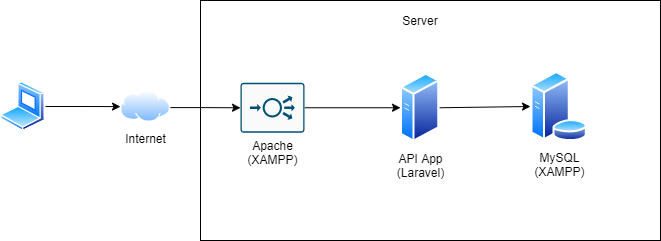
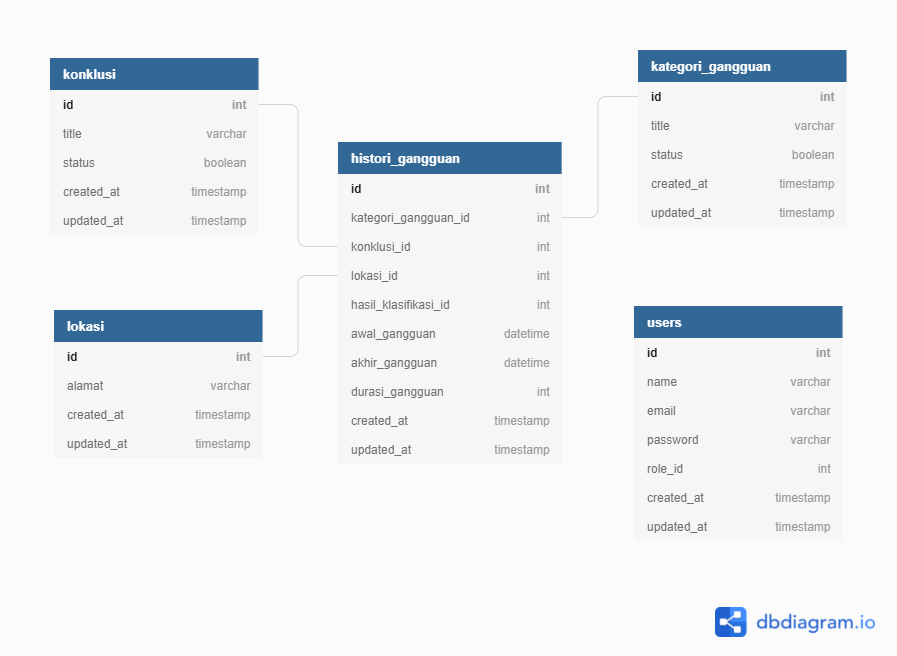

# Introduction

This repository contains about a decision making system (read in bahasa: sistem pengambil keputusan) web application with The Analytic Hierarchy Process (AHP) methodelogy.

# Tech Stack

I used these tech stack for create this project with:
* PHP 7
* [Laravel](https://laravel.com/)
* MySQL
* [StarAdmin](https://www.bootstrapdash.com/product/star-admin-free/)
* [jQuery](https://jquery.com/)

# Architecture

# DB Schema

# Implemented Features

This tables shows which features that has been implemented by this repository.

:white_check_mark: : ready

:heavy_exclamation_mark: : in progress

:x: : not yet implemented

| Features                          | Sub Features                     | Status                              |
| --------------------------------- | -------------------------------- | ----------------------------------- |
| User Authentication               | Login                            | :white_check_mark:                  |
| User Authorization                | Admin                            | :white_check_mark:                  |
|                                   | User                             | :white_check_mark:                  |
| User Management                   | Get All Members                  | :white_check_mark:                  |
|                                   | Add New Member                   | :white_check_mark:                  |
|                                   | Edit Existing Member             | :white_check_mark:                  |
|                                   | Remove Existing Member           | :white_check_mark:                  |
| Histori Gangguan                  | Get All Histori Gangguan         | :white_check_mark:                  |
|                                   | Add New Histori Gangguan         | :white_check_mark:                  |
|                                   | Edit Existing Histori Gangguan   | :white_check_mark:                  |
|                                   | Remove Existing Histori Gangguan | :white_check_mark:                  |
|                                   | Export CSV                       | :white_check_mark:                  |
| Restitusi                         | Get All Restitusi                | :white_check_mark:                  |
|                                   | Get Restitusi Detail             | :white_check_mark:                  |
|                                   | Export CSV                       | :white_check_mark:                  |
| Kategori Gangguan                 | Get All Kategori Gangguan        | :white_check_mark:                  |
|                                   | Add New Kategori Gangguan        | :white_check_mark:                  |
|                                   | Edit Existing Histori Gangguan   | :white_check_mark:                  |
|                                   | Remove Exist Kategori Gangguan   | :white_check_mark:                  |
| Action Konklusi                   | Get All Konklusi                 | :white_check_mark:                  |
|                                   | Add New Konklusi                 | :white_check_mark:                  |
|                                   | Edit Existing Konklusi           | :white_check_mark:                  |
|                                   | Remove Exist Konklusi            | :white_check_mark:                  |
| Lokasi                            | Get All Lokasi                   | :white_check_mark:                  |
|                                   | Add New Lokasi                   | :white_check_mark:                  |
|                                   | Edit Existing Lokasi             | :white_check_mark:                  |
|                                   | Remove Exist Lokasi              | :white_check_mark:                  |

# Test Cases

We already create test cases list. You can download [here](https://github.com/rizkyjayusman/spk-ahp/blob/master/docs/TestCase.xlsx)

# Installation and Run

We already create guide to install and run this project. You can see [here](https://docs.google.com/document/d/1lfyt8s28kM8s_Dtj-mF7uFzfh8OQI8D6A1Tr4hFCjKs/edit?usp=sharing)