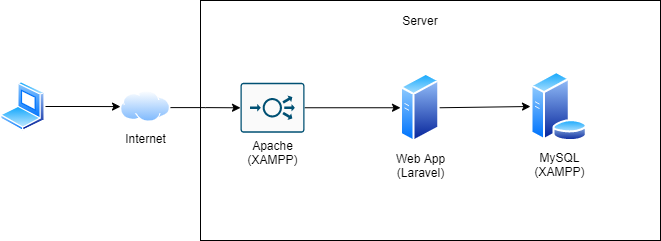

# Introduction

This repository contains about a deposit and loan management application in a village that nowhere. hehe.

# Tech Stack

I used these tech stack for create this project with:
* PHP 7
* [Laravel](https://laravel.com/)
* MySQL

# Architecture

<div align='center'>



</div>

# DB Schema

<div align='center'>


</div>

# Implemented Features

This tables shows which features that has been implemented by this repository.

:white_check_mark: : ready

:heavy_exclamation_mark: : in progress

:x: : not yet implemented

| Features                          | Sub Features                     | Status                              |
| --------------------------------- | -------------------------------- | ----------------------------------- |
| User Authentication               | Login                            | :white_check_mark:                  |
| User Authorization                | Admin                            | :white_check_mark:                  |
|                                   | User                             | :white_check_mark:                  |
| User Management                   | Get All Members                  | :white_check_mark:                  |
|                                   | Add New Member                   | :white_check_mark:                  |
|                                   | Edit Existing Member             | :white_check_mark:                  |
|                                   | Remove Existing Member           | :white_check_mark:                  |
| Histori Gangguan                  | Get All Histori Gangguan         | :white_check_mark:                  |
|                                   | Add New Histori Gangguan         | :white_check_mark:                  |
|                                   | Edit Existing Histori Gangguan   | :white_check_mark:                  |
|                                   | Remove Existing Histori Gangguan | :white_check_mark:                  |
|                                   | Export CSV                       | :white_check_mark:                  |
| Restitusi                         | Get All Restitusi                | :white_check_mark:                  |
|                                   | Get Restitusi Detail             | :white_check_mark:                  |
|                                   | Export CSV                       | :white_check_mark:                  |
| Kategori Gangguan                 | Get All Kategori Gangguan        | :white_check_mark:                  |
|                                   | Add New Kategori Gangguan        | :white_check_mark:                  |
|                                   | Edit Existing Histori Gangguan   | :white_check_mark:                  |
|                                   | Remove Exist Kategori Gangguan   | :white_check_mark:                  |
| Action Konklusi                   | Get All Konklusi                 | :white_check_mark:                  |
|                                   | Add New Konklusi                 | :white_check_mark:                  |
|                                   | Edit Existing Konklusi           | :white_check_mark:                  |
|                                   | Remove Exist Konklusi            | :white_check_mark:                  |
| Lokasi                            | Get All Lokasi                   | :white_check_mark:                  |
|                                   | Add New Lokasi                   | :white_check_mark:                  |
|                                   | Edit Existing Lokasi             | :white_check_mark:                  |
|                                   | Remove Exist Lokasi              | :white_check_mark:                  |


# Installation and Run (Using XAMPP)

### XAMPP Installation

comming soon!

### Composer Installation

comming soon!

### Run
```
1. Clone the Project
   $ git clone https://github.com/rizkyjayusman/spk-ahp.git
   $ cd spk-ahp

2. Install Dependencies
   $ composer install

3. Migrate Table
   $ php artisan migrate

3. Run the Project
   $ php artisan serve
```

# Build and Run (With Laradock)

```
1. Clone the Project
   $ git clone git@github.com:rizkyjayusman/cooperation.git
   $ cd cooperation

2. Build and Package the Project
   $ docker build -t alami-cooperation-app .
   $ docker-compose up -d --build
```
